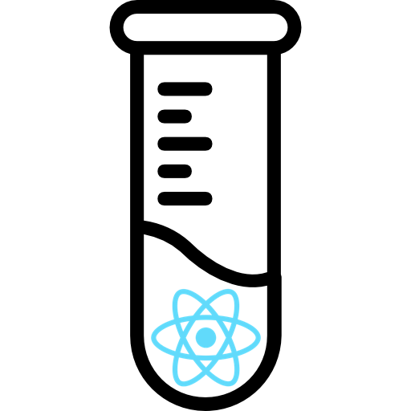
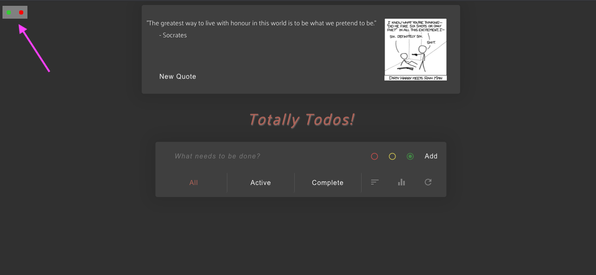
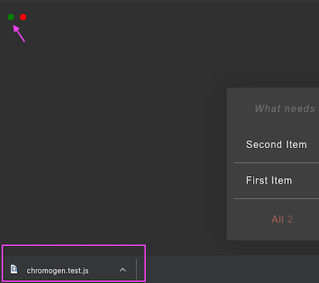
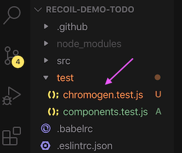
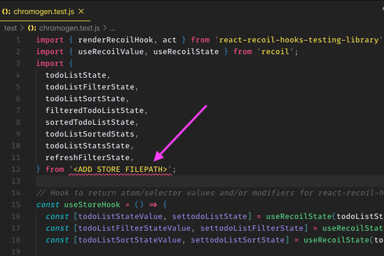
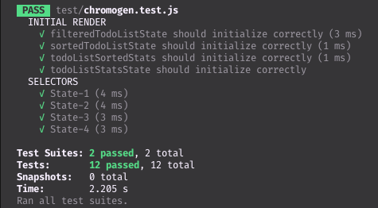

<div align="center">
<h1>Chromogen</h1>

<!-- replace link with homepage when site is launched -->
<a href="https://www.npmjs.com/package/chromogen">
  
</a>

<h3>A UI-driven test-generation package for <a href="</a>">Recoil</a> selectors.</h3>

# [](http://makeapullrequest.com) [](https://github.com/oslabs-beta/Chromogen/blob/master/LICENSE) [](https://www.npmjs.com/package/chromogen) [](https://www.npmjs.com/package/chromogen) [](https://github.com/oslabs-beta/Chromogen)

</div>

## Table of Contents

- [Overview](#overview)
- [Installation](#installation)
- [Usage](#usage)
- [Contributing](#contributing)
- [Core Team](#core-team)
- [License](#license)

## Overview

You're an independent developer or part of a lean team. You want reliable tests for your new React-Recoil app, but you need to move fast and time is major constraint. Additionally, you want your tests to reflect how your users interact with the app, rather than testing implementation details.

Enter [Chromogen](https://www.npmjs.com/package/chromogen). Chromogen is a Jest test-generation tool for Recoil selectors. It captures state changes during user interaction and auto-generates corresponding test files for your selectors. Simply launch your app after following the installation instructions below, interact as a user normally would, and with one click you'll download a ready-to-run Jest test file.

#### Chromogen is currently in active beta
Testing for pre-composed, synchronous, read-only selectors is now fully functional. However, support for the following features is still in development:
  1. Writeable selectors
  1. Asyncronous selectors
  1. Dynamically generated selectors

## Installation

To run Chromogen, you'll need to make two changes to your application:
  1. Import the `<ChromogenObserver />` component as a child of `<RecoilRoot />`
  2. Import all atoms and selectors from Chromogen instead of Recoil

These changes do have a small performance cost, so they should be reverted before deploying to production.

### Download the Chromogen package from npm.

```
npm install chromogen
```

### Import the ChromogenObserver component
ChromogenObserver should be included as a direct child of RecoilRoot. It does not need to wrap any of your other components, and it takes no props. It utilizes Recoil's TransactionObserver hook to record snapshots on state change.

```jsx
import React from 'react';
import { RecoilRoot } from 'recoil';
import { ChromogenObserver } from 'chromogen';
import MyComponent from './components/MyComponent.jsx';

const App = (props) => (
    <RecoilRoot>
      <ChromogenObserver />
      <MyComponent {...props} />
    </RecoilRoot>
)

export default App;
```

### Import atoms & selectors from Chromogen
Wherever you import `atom` and/or `selector` from Recoil (typically in your `store` file), import them from Chromogen instead. The arguments passed in do **not** need to change in any away, and the return value will still be a normal RecoilAtom or RecoilSelector.  Chromogen wraps the native Recoil functions to track which pieces of Recoil state have been created, as well as when various selectors are running and what values they return.

```js
import { atom, selector } from 'chromogen';

export const fooState = atom({
  key: 'fooState',
  default: {},
});

export const barState = selector({
  key: 'barState',
  get: ({ get }) => {
    const derivedState = get(fooState);
    return derivedState.baz || 'value does not exist';
  }
})
```

## Usage
After following the installation steps above, launch you app as you normally would. You should see two small dots in the top left corner.



The green button, on the left, is the **Download** button. Clicking it will download a new test file that includes _all_ tests generated since the app was last launched or refreshed.

The red button, on the right, is the **recording toggle**. Clicking it will pause recording, so that no tests are generated during subsequent state changes. Red indicates "recording in progress" and yellow means the recording is paused. Pausing is useful for setting up a complex initial state with repetitive actions, where you don't want to test every step of the process.

_For example,_ if we want to test our Todo app's filter and sort buttons, we may want to have 10 or so different items with various priority levels and completion states. However, we don't necessarily want 10 separate tests just for adding items. We can instead add one or two items to generate tests for that functionality, then pause recording while we add the other 8 items. Once everything is added, we can resume recording to generate filter & sort tests with all 10 items present.

<hr />

Once you've recorded all the interactions you want to test, click the green button to download the test file. Then just drag-and-drop the downloaded file into your app's test directory.

 

Before running the test file, you'll need to specify the import path for your store by replacing `<ADD STORE FILEPATH>`. The default output assumes that all atoms and selectors are imported from a single path; if that's not possible, you'll need to separately import each set of atoms and/or selectors from their appropriate path.

### BEFORE:


### AFTER:


You're now ready to run your tests! Upon running your normal Jest test command, you should see two suites for `chromogen.test.js`:



**Initial Render** tests whether each selector returns the correct value at launch. There is one test per selector.

**Selectors** tests the return value of various selectors for a given state. Each test (`State-#`) represents the app state after a transaction has occured, generally triggered by some user interaction. For each selector that ran after that transaction, the test asserts on the selector's return value for the given state.
###### An update to make the test names more descriptive is currently in the works.

**Please note:** You may see `console.error` messages about updating a `Batcher` component. This is a [known issue](https://github.com/facebookexperimental/Recoil/issues/12) due to conflicts between the current releases of React and Recoil. Pending a Recoil update, we are working on a way to suppress this warning within the test suite.

## Contributing
We welcome community contributions, including new developers who've never [made an open source Pull Request before](https://egghead.io/courses/how-to-contribute-to-an-open-source-project-on-github). If you'd like to start a new PR, we recommend [creating an issue](https://docs.github.com/en/github/managing-your-work-on-github/creating-an-issue) for discussion first. This lets us open a conversation, ensuring work is not duplicated unnecessarily and that the proposed PR is a fix or feature we're actively looking to add.

### Bugs

Please [file an issue](https://docs.github.com/en/github/managing-your-work-on-github/creating-an-issue) for bugs, missing documentation, or unexpected behavior.

### Feature Requests

Please file an issue to suggest new features. Vote on feature requests by adding
a 👍. This helps us prioritize what to work on.

### Questions

For questions related to using the package, you may either file an issue or _gmail_ us: `chromogen.app`.

## Core Team
<table>
  <tr>
    <td align="center"><a href="https://github.com/michellebholland"><br /><sub><b>Michelle Holland</b></sub></a></td>
    <!-- SPACE -->
    <td align="center"><a href="https://github.com/chenchingk"><br /><sub><b>Jim Chen</b></sub></a></td>
    <!-- SPACE -->
    <td align="center"><a href="https://github.com/andywang23"><br /><sub><b>Andy Wang</b></sub></a></td>
    <!-- SPACE -->
    <td align="center"><a href="https://github.com/connorrose"><br /><sub><b>Connor Rose Delisle</b></sub></a></td>
  </tr>
  </table>

## LICENSE
Logo remixed from [ReactJS](https://github.com/reactjs/reactjs.org) under [CC BY 4.0](https://creativecommons.org/licenses/by/4.0/) and [Smashicons](https://www.flaticon.com/authors/smashicons) via [www.flaticon.com](https://www.flaticon.com/)

README format inspired by [react-testing-library](https://github.com/testing-library/react-testing-library/blob/master/README.md) under [MIT license](https://github.com/testing-library/react-testing-library/blob/master/LICENSE).

All Chromogen source code is [MIT](./LICENSE) licensed.