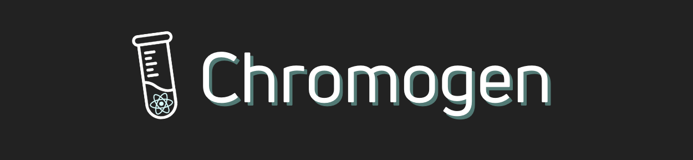
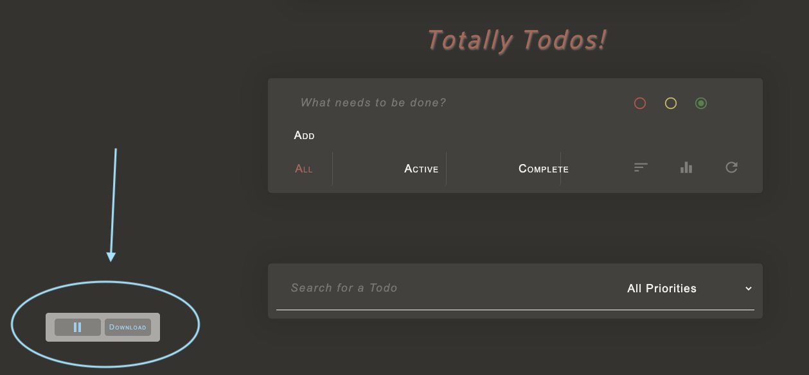
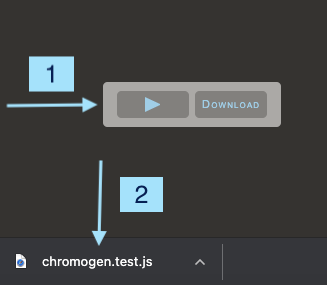
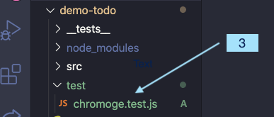
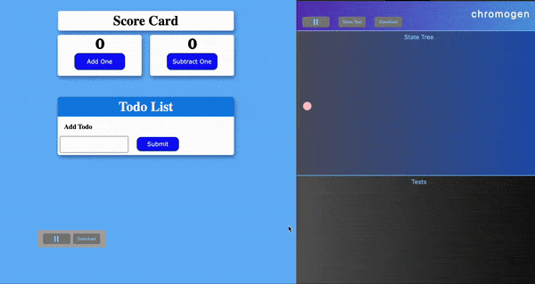
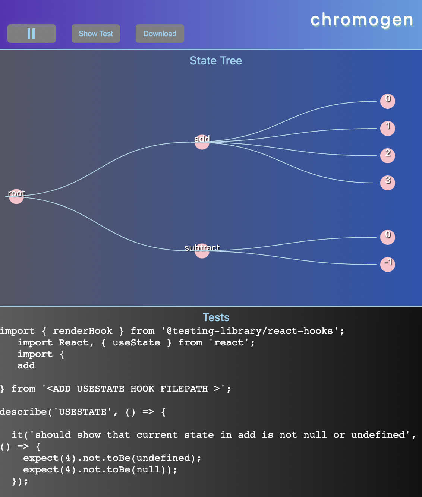

<div align="center">

<a href="https://chromogen.dev">
  
</a>

<h3>A UI-driven test-generation package for <a href="https://github.com/facebookexperimental/Recoil">Recoil.js</a> selectors and <a href="https://github.com/facebook/react">React</a> useState Hooks.</h3>

<br />

<!--- Update coverage badge to main repo once Coveralls permission is granted --->

[](https://www.npmjs.com/package/chromogen)
[](https://travis-ci.org/oslabs-beta/Chromogen)
[](https://coveralls.io/github/oslabs-beta/Chromogen?branch=master)
[](https://github.com/oslabs-beta/Chromogen/blob/master/LICENSE)

[](https://twitter.com/intent/tweet?text=CHROMOGEN%20-%20A%20UI-driven%20Jest%20test%20generator%20for%20Recoil%20apps%0A&url=https://www.npmjs.com/package/Chromogen&hashtags=React,Recoil,Jest,testing)
[](http://makeapullrequest.com)
[](https://www.npmjs.com/package/chromogen)
[](https://github.com/open-source-labs/Chromogen)
<br />

</div>
<br />

## Table of Contents

- [Overview](#overview)
- [Installation for Recoil Apps](#installation-for-recoil-apps)
- [Usage for Recoil Apps](#usage-for-recoil-apps)
- [Installation for Hooks Apps](#installation-for-hooks-apps)
- [Usage for Hooks Apps](#usage-for-hooks-apps)
- [New and Improved Chrome DevTool](<#new-and-improved-chrome-devtool>)
- [Contributing](#contributing)
- [Core Team](#core-team)
- [License](#license)
  <Br><br />

## Overview

You're an independent developer or part of a lean team. You want reliable unit tests for your new React-Recoil or React Hooks app, but you need to move fast and time is a major constraint. More importantly, you want your tests to reflect how your users interact with the application, rather than testing implementation details.

[Enter Chromogen](https://www.npmjs.com/package/chromogen). Chromogen is a Jest unit-test generation tool for Recoil selectors and React useState Hooks. It captures state changes during user interaction and auto-generates corresponding test suites. Simply launch your application after following the installation instructions below, interact as a user normally would, and with one click you can download a ready-to-run Jest test file.

### Chromogen is currently in active Beta
  
### Chromogen is now compatible with React V18!

<b>FOR RECOIL APPS</b>

Chromogen currently supports three main types of tests for Recoil apps:

1. **Initial selector values** on page load
2. **Selector return values** for a given state, using snapshots captured after each state transaction.
3. **Selector _set_ logic** asserting on resulting atom values for a given `newValue` argument and starting state.

These test suites will be captured for _synchronous_ selectors and selectorFamilies only. However, the presence of asyncronous selectors in your app should not cause any issues with the generated tests. Chromogen can identify such selectors at run-time and exclude them from capture.

At this time, we have no plans to introduce testing for async selectors; the mocking requirements are too opaque and fragile to accurately capture at runtime.

By default, Chromogen uses atom and selector keys to populate the import & hook statements in the test file. If your source code does _not_ use matching variable and key names, you will need to pass the imported atoms and selectors to the ChromogenObserver component as a `store` prop. The installation instructions below contain further details.
<br><Br>

<b>FOR REACT HOOKS APPS</b>

Chromogen currently supports one main type of test for React Hooks Apps:

1. **Initial state values** on page load for useState Hooks
2. **useState's returned state variable** - _in beta_

Currently, these test suites will be captured only for the useState Hook. We are working on adding testing for the useReducer Hook in the near future.
<br><Br>

We are always open to suggestions to meet the needs of our userbase. Want to see this or any other feature added to the package? [Let us know!](#contributing)
<br><Br>

### Recoil Demo To-Do App

Chromogen's [official Recoil demo app](demo-todo/README.md) provides a ready-to-run Recoil frontend with a number of different selector implementations to test against. It's available in the `demo-todo` folder of this repository and comes with Chromogen pre-installed; just run `npm install && npm start` to launch.

<Br>

## Installation for Recoil Apps

Before running Chromogen, you'll need to make two changes to your application:

1. Import the `<ChromogenObserver />` component as a child of `<RecoilRoot />`
1. Import the `atom` and `selector` functions from Chromogen instead of Recoil

<i>Note: These changes do have a small performance cost, so they should be reverted before deploying to production.</i>

### Download the Chromogen package from npm

```
npm install chromogen
```

### Import the ChromogenObserver component

ChromogenObserver should be included as a direct child of RecoilRoot. It does not need to wrap any other components, and it takes no mandatory props. It utilizes Recoil's TransactionObserver Hook to record snapshots on state change.

```jsx
import React from 'react';
import { RecoilRoot } from 'recoil';
import { ChromogenObserver } from 'chromogen';
import MyComponent from './components/MyComponent.jsx';

const App = (props) => (
  <RecoilRoot>
    <ChromogenObserver />
    <MyComponent {...props} />
  </RecoilRoot>
);

export default App;
```

If you are using pseudo-random key names, such as with _UUID_, you'll need to pass all of your store exports to the ChromogenObserver component as a `store` prop. This will allow Chromogen to use source code variable names in the output file, instead of relying on keys. When all atoms and selectors are exported from a single file, you can pass the imported module directly:

```jsx
import * as store from './store';
// ...
<ChromogenObserver store={store} />;
```

If your store utilizes seprate files for various pieces of state, you can pass all of the imports in an array:

```jsx
import * as atoms from './store/atoms';
import * as selectors from './store/selectors';
import * as misc from './store/arbitraryRecoilState';
// ...
<ChromogenObserver store={[atoms, selectors, misc]} />;
```

### Import atom & selector functions from Chromogen

Wherever you import `atom` and/or `selector` functions from Recoil (typically in your `store` file), import them from Chromogen instead. The arguments passed in do **not** need to change in any away, and the return value will still be a normal RecoilAtom or RecoilSelector. Chromogen wraps the native Recoil functions to track which pieces of state have been created, as well as when various selectors are called and what values they return.

```js
import { atom, selector } from 'chromogen';

export const fooState = atom({
  key: 'fooState',
  default: {},
});

export const barState = selector({
  key: 'barState',
  get: ({ get }) => {
    const derivedState = get(fooState);
    return derivedState.baz || 'value does not exist';
  },
});
```

<br><Br>

## Usage for Recoil Apps

After following the installation steps above, launch your application as normal. You should see two buttons in the bottom left corner.

<div align="center">



</div>

The pause button on the left is the **pause recording** button. Clicking it will pause recording, so that no tests are generated during subsequent state changes. Clicking it will pause recording, so that no tests are generated during subsequent state changes. Pausing is useful for setting up a complex initial state with repetitive actions, where you don't want to test every step of the process.

The button on the right is the **download** button. Clicking it will download a new test file that includes _all_ tests generated since the app was last launched or refreshed.

For example, if we want to test our demo to-do app's filter and sort buttons, we may want to have 10 or so different items with various priority levels and completion states. However, we don't necessarily want 10 separate tests just for adding items. We can instead add one or two items to generate tests for that functionality, then pause recording while we add the other 8 items. Once everything is added, we can resume recording to generate filter & sort tests with all 10 items present.

Once you've recorded all the interactions you want to test, click the pause button and then the download button to download the test file. You can now drag-and-drop the downloaded file into your app's test directory.

<div align="center">

&nbsp;&nbsp;&nbsp;&nbsp;

</div>

Before running the test file, you'll need to specify the import path for your store by replacing `<ADD STORE FILEPATH>`. The default output assumes that all atoms and selectors are imported from a single path; if that's not possible, you'll need to separately import each set of atoms and/or selectors from their appropriate path.

|                          **BEFORE**                           |                          **AFTER**                           |
| :-----------------------------------------------------------: | :----------------------------------------------------------: |
|  |  |

You're now ready to run your tests! Upon running your normal Jest test command, you should see three suites for `chromogen.test.js`:

<div align="center">


</div>

**Initial Render** tests whether each selector returns the correct value at launch. There is one test per selector.

**Selectors** tests the return value of various selectors for a given state. Each test represents the app state after a transaction has occured, generally triggered by some user interaction. For each selector that ran after that transaction, the test asserts on the selector's return value for the given state.

**Setters** tests the state that results from setting a writeable selector with a given value and starting state. There is one test per set call, asserting on each atom's value in the resulting state.
<br><br><Br>

## Installation for Hooks Apps

Before using Chromogen, you'll need to make two changes to your application:

1. Import the `<HooksChromogenObserver />` component and wrap it around the parent most `<App />`
2. Import `useState` function from Chromogen instead of React. Chromogen has engineered `useState` to track state changes.

### Download the Chromogen package from npm

```
npm install chromogen
```

### Import the HooksChromogenObserver component

Import `HooksChromgenObserver`. HooksChromogenObserver should wrap the parent most component of the user's app (usually inside of `index.js`).

```jsx
import React from 'react';
import { createRoot } from 'react-dom/client';
import App from './App';
import { HooksChromogenObserver } from 'chromogen';

const root = createRoot(document.getElementById('root'));

root.render(
  <HooksChromogenObserver name="App">
    <App />
  </HooksChromogenObserver>
);  
```

### Import useState Hook from Chromogen

Chromogen has engineered React's `useState` Hook to include a state change tracker. Wherever your app imports `useState` from React, import `useState` from Chromogen instead.

By default, Chromogen requires a second `id` parameter (a string describing your chosen label for state) in the useState hooks to generate a test suite for the user's application.

```jsx
import React from 'react';
import { useState as hooksUseState } from 'chromogen';

const App: React.FC = () => {
  const [elements, setElements] = hooksUseState<number>(0, "id");
  return (...)
};
```

<br> <br>

## Usage for Hooks Apps

After following the installation steps above, launch your application as normal. You should see two buttons in the bottom left corner.

<div align="center">



</div>

The pause button on the left is the **pause recording** button. Clicking it will pause recording, so that no tests are generated during subsequent state changes. Clicking it will pause recording, so that no tests are generated during subsequent state changes. Pausing is useful for setting up a complex initial state with repetitive actions, where you don't want to test every step of the process.

The button on the right is the **download** button. Clicking it will download a new test file that includes _all_ tests generated since the app was last launched or refreshed.

Once you've recorded all the interactions you want to test, click the pause button and then the download button to generate the test file. You can now drag-and-drop the downloaded file into your app's test directory.

You're now ready to run your tests! After running your normal Jest test command, you should see a test suite for `chromogen.test.js`.

The current tests check whether state has changed after an interaction and checks whether the resulting state change variables have been updated as expected.

<br><br>

## New and Improved Chrome DevTool!

[Install Chromogen DevTool Extension V3.0.0](https://chrome.google.com/webstore/detail/chromogen-developer-tool/ehhlabbajneoafjedaaogkmpeaclepdl)

DevTool V3.0.0 now shows a _**dynamic D3 state tree**_ responsive to user interaction with application! Press **pause recording** then click **Show Test** to see auto-generated tests right in the DevTool. Similar to an IDE, the test can be edited in the DevTool for ease of use. Then to download the file, click **Download** to generate a `js` file that can be saved into your codebase.
  
<div align="center">


<!--  -->

</div>

_Note:_ You may also access the DevTool can be added as an unpacked extension by running `npm install && npm run build` in the `dev-tool` subdirectory and loading the resulting `build` folder.
<Br><br><br>

## Contributing

**We expect all contributors to abide by the standards of behavior outlined in the [Code of Conduct](CODE_OF_CONDUCT.md).**

We welcome community contributions, including new developers who've never [made an open source Pull Request before](https://egghead.io/courses/how-to-contribute-to-an-open-source-project-on-github). If you'd like to start a new PR, we recommend [creating an issue](https://docs.github.com/en/github/managing-your-work-on-github/creating-an-issue) for discussion first. This lets us open a conversation, ensuring work is not duplicated unnecessarily and that the proposed PR is a fix or feature we're actively looking to add.

### Bugs

Please [file an issue](https://docs.github.com/en/github/managing-your-work-on-github/creating-an-issue) for bugs, missing documentation, or unexpected behavior.

### Feature Requests

Please file an issue to suggest new features. Vote on feature requests by adding
a 👍. This helps us prioritize what to work on.

### Questions

For questions related to using the package, you may either file an issue or _gmail_ us: `chromogen3.0dev`.
<br><Br>

## Core Team

<br>

<table>
  <tr align="center">
    <td align="center"><a href="https://github.com/michellebholland"><br /><sub><b>Michelle Holland</b></sub></a></td>
    <!-- SPACE -->
    <td align="center"><a href="https://github.com/andywang23"><br /><sub><b>Andy Wang</b></sub></a></td>
    <!-- SPACE -->
    <td align="center"><a href="https://github.com/connorrose"><br /><sub><b>Connor Rose Delisle</b></sub></a></td>
    <!-- SPACE -->
    <td align="center"><a href="https://github.com/chenchingk"><br /><sub><b>Jim Chen</b></sub></a></td>
   <!-- SPACE -->
  <td align="center"><a href="https://github.com/amyy98"><br /><sub><b>Amy Yee</b></sub></a></td>
     <!-- SPACE -->
      <td align="center"><a href="https://github.com/wlstjs"><br /><sub><b>Jinseon Shin</b></sub></a></td>
   <!-- SPACE -->
       <td align="center"><a href="https://github.com/rtumel123"><br /><sub><b>Ryan Tumel</b></sub></a></td>
       <!-- SPACE -->
         <td align="center"><a href="https://github.com/cgreer011"><br /><sub><b>Cameron Greer</b></sub></a></td>
          <!-- SPACE -->
         <td align="center"><a href="https://github.com/nicholasjs"><br /><sub><b>Nicholas Shay</b></sub></a></td>
</tr>
<tr align="center">
              <!-- SPACE -->
         <td align="center"><a href="https://github.com/mp-04"><br /><sub><b>Marcellies Pettiford</b></sub></a></td>
    <!-- SPACE -->
         <td align="center"><a href="https://github.com/smk53664"><br /><sub><b>Sung Kim</b></sub></a></td>
    <!-- SPACE -->
         <td align="center"><a href="https://github.com/lina4lee"><br /><sub><b>Lina Lee</b></sub></a></td>
    <!-- SPACE -->
         <td align="center"><a href="https://github.com/ericaysoh"><br /><sub><b>Erica Oh</b></sub></a></td>
    <!-- SPACE -->
         <td align="center"><a href="https://github.com/dtalmaraz"><br /><sub><b>Dani Almaraz</b></sub></a></td>
    
</tr>
</table>
<br><br>

## LICENSE

Logo remixed from [ReactJS](https://github.com/reactjs/reactjs.org) under [CC BY 4.0](https://creativecommons.org/licenses/by/4.0/) and [Smashicons](https://www.flaticon.com/authors/smashicons) via [www.flaticon.com](https://www.flaticon.com/)

README format adapted from [react-testing-library](https://github.com/testing-library/react-testing-library/blob/master/README.md) under [MIT license](https://github.com/testing-library/react-testing-library/blob/master/LICENSE).

All Chromogen source code is [MIT](./LICENSE) licensed.

Lastly, shoutout to [this repo](https://github.com/conorhastings/redux-test-recorder) for the original inspiration.
