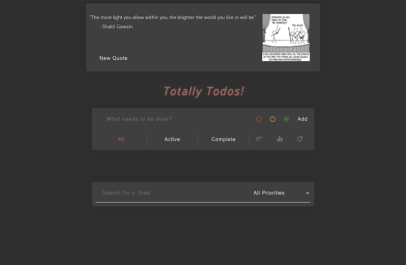

# The official demo app for [Chromogen](https://github.com/oslabs-beta/Chromogen).

## Selector Implementations
  - Readonly:
    1. displayed todo list items, based on filter selection (sort & active/complete)
    2. stats (priority count and active/complete counts)
    3. displayed todo list empty / non-empty
  - Writeable:
    1. "all complete" checkbox toggle
    1. reset filter states
  - Promise:
    1. quote text
  - Async / Await:
    1. xkcd comic
  - selectorFamily:
    1. search bar