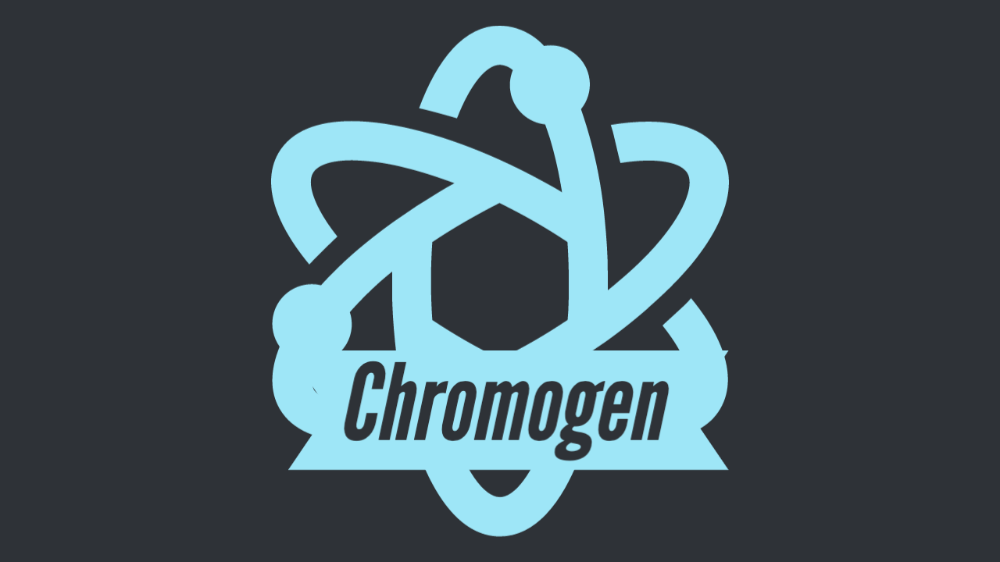
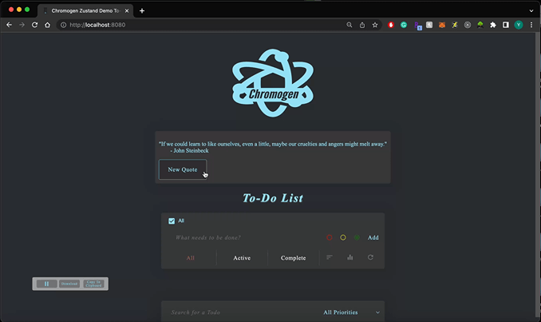

<div align="center">
<h1>Chromogen</h1>
<a href="https://github.com/open-source-labs/Chromogen">
  
</a>

<h3>A UI-driven Jest test-generation package for <a href="https://www.npmjs.com/package/recoil">Recoil.js</a> selectors and <a href="https://www.npmjs.com/package/zustand">Zustand</a> store hooks.</h3>

<br />

[](https://www.npmjs.com/package/chromogen)
[](https://travis-ci.org/oslabs-beta/Chromogen)
[](https://github.com/oslabs-beta/Chromogen/blob/master/LICENSE)
<br />

</div>
<br />

**Now Compatible with React V18**

Chromogen (Now on Version 4.0) is a Jest unit-test generation tool for Zustand Stores and Recoil selectors. It captures state changes during user interaction and auto-generates corresponding test suites. Simply launch your application after following the installation instructions below, interact as a user normally would, and with one click you can download a ready-to-run Jest test file. Alternatively, you can copy the generated tests straight to your clipboard.
<br /><br /><br />

## Installation for Zustand Apps

Before using Chromogen, you'll need to make two changes to your application:

1. Import the `<ChromogenZustandObserver />` component and render it alongside any other components in `<App />`
2. Import `chromogenZustandMiddleware` function from Chromogen. This will be used as middleware when setting up your store.

### Import the ChromogenZustandObserver component

Import `ChromogenZustandObserver`. ChromogenZustandObserver can be rendered alongside any other components in `<App />`.

```jsx
import React from 'react';
import { ChromogenZustandObserver } from 'chromogen';
import TodoList from './TodoList';

const App = () => (
  <>
    <ChromogenZustandObserver />
    <TodoList />
  </>
);

export default App;
```

Import `chromogenZustandMiddleware`. When you call create, wrap your store function with chromogenZustandMiddleware. **Note**, when using chromogenZustandMiddleware, you'll need to provide some additional arguments into the set function.

1. _Overwrite State_ (boolean) - Without middleware, this defaults to `false`, but you'll need to explicitly provide a value when using Chromogen.
2. _Action Name_ - Used for test generation
3. _Action Parameters_ - If the action requires input parameters, pass these in after the Action Name.

```jsx
import { chromogenZustandMiddleware } from 'chromogen';
import create from 'zustand';

const useStore = create(
  chromogenZustandMiddleware((set) => ({
    counter: 0,
    color: 'black',
    prioritizeTask: ['walking', 5],
    addCounter: () => set(() => ({ counter: (counter += 1) }), false, 'addCounter'),
    changeColor: (newColor) => set(() => ({ color: newColor }), false, 'changeColor', newColor),
    setTaskPriority: (task, priority) =>
      set(() => ({ prioritizeTask: [task, priority] }), false, 'setTaskPriority', task, priority),
  })),
);

export default useStore;
```

<br><hr>

## Installation for Recoil Apps

Before running Chromogen, you'll need to make two changes to your application:

1. Import the `<ChromogenObserver />` component as a child of `<RecoilRoot />`
1. Import the `atom` and `selector` functions from Chromogen instead of Recoil

<i>Note: These changes do have a small performance cost, so they should be reverted before deploying to production.</i>

<br>

### Import the ChromogenObserver component

ChromogenObserver should be included as a direct child of RecoilRoot. It does not need to wrap any other components, and it takes no mandatory props. It utilizes Recoil's TransactionObserver Hook to record snapshots on state change.

```jsx
import React from 'react';
import { RecoilRoot } from 'recoil';
import { ChromogenObserver } from 'chromogen';
import MyComponent from './components/MyComponent.jsx';

const App = (props) => (
  <RecoilRoot>
    <ChromogenObserver />
    <MyComponent {...props} />
  </RecoilRoot>
);

export default App;
```

If you are using pseudo-random key names, such as with _UUID_, you'll need to pass all of your store exports to the ChromogenObserver component as a `store` prop. This will allow Chromogen to use source code variable names in the output file, instead of relying on keys. When all atoms and selectors are exported from a single file, you can pass the imported module directly:

```jsx
import * as store from './store';
// ...
<ChromogenObserver store={store} />;
```

If your store utilizes seprate files for various pieces of state, you can pass all of the imports in an array:

```jsx
import * as atoms from './store/atoms';
import * as selectors from './store/selectors';
import * as misc from './store/arbitraryRecoilState';
// ...
<ChromogenObserver store={[atoms, selectors, misc]} />;
```

<br>

### Import atom & selector functions from Chromogen

Wherever you import `atom` and/or `selector` functions from Recoil (typically in your `store` file), import them from Chromogen instead. The arguments passed in do **not** need to change in any away, and the return value will still be a normal RecoilAtom or RecoilSelector. Chromogen wraps the native Recoil functions to track which pieces of state have been created, as well as when various selectors are called and what values they return.

```js
import { atom, selector } from 'chromogen';

export const fooState = atom({
  key: 'fooState',
  default: {},
});

export const barState = selector({
  key: 'barState',
  get: ({ get }) => {
    const derivedState = get(fooState);
    return derivedState.baz || 'value does not exist';
  },
});
```

<br><hr>

## Usage for All Apps

After following the installation steps above, launch your application as normal. You should see two buttons in the bottom left corner.

<div align="center">



</div>

The pause button on the left is the **pause recording** button. Clicking it will pause recording, so that no tests are generated during subsequent state changes. Pausing is useful for setting up a complex initial state with repetitive actions, where you don't want to test every step of the process.

The button in the middle is the **download** button. Clicking it will download a new test file that includes _all_ tests generated since the app was last launched or refreshed.

The button on the right is the **copy-to-clipboard** button. Clicking it will copy your tests, including _all_ tests generated since the app was last launched or refreshed.

Once you've recorded all the interactions you want to test, click the pause button and then the download button to generate the test file or press copy to copy to your clipboard. You can now drag-and-drop the downloaded file into your app's test directory or paste the code in your new file. **Don't forget to add the source path in your test file**

You're now ready to run your tests! After running your normal Jest test command, you should see a test suite for `chromogen.test.js`.

The current tests check whether state has changed after an interaction and checks whether the resulting state change variables have been updated as expected.

<br><hr>

Please visit our [main repo](https://github.com/open-source-labs/Chromogen) for more detailed instructions, as well as any bug reports, support issues, or feature requests.
